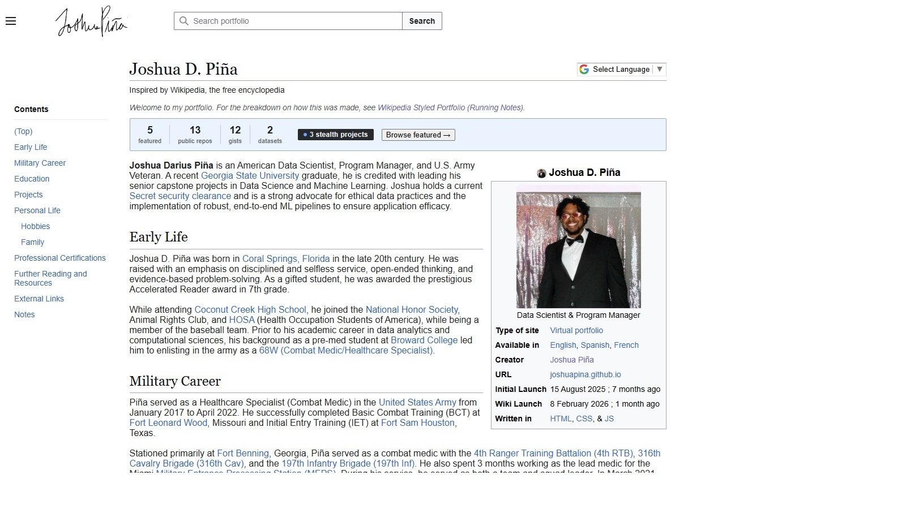
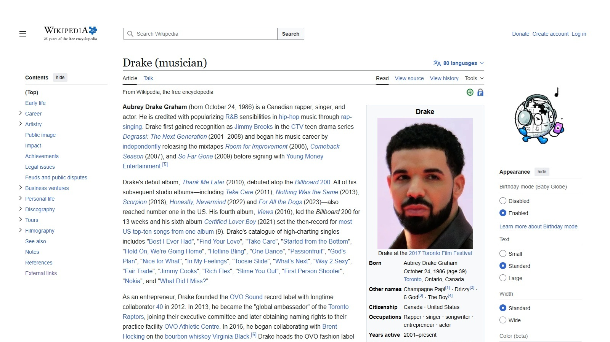

# HOW I Built This Portfolio

## At a Glance
- Goal: Build a portfolio that feels like a living technical profile.
- Style direction: Wikipedia-inspired structure, adapted to my own brand.
- Stack: HTML + CSS + JavaScript + GitHub Pages.
- LLM use: Intentional support layer, not full delegation.

## Why I Made It This Way
I wanted this portfolio to feel like me: technical, organized, and a little obsessive about documentation.

A normal portfolio layout felt too generic, so I went with a Wikipedia-style format. I like how Wikipedia pages are structured: easy to scan, sectioned clearly, and packed with links and context. That matched exactly how I wanted to present my work.

This was never about pretending to be Wikipedia. It was about borrowing a familiar reading experience and using it to tell my own story better.

## The Basic Idea
I treated the site like a personal knowledge page:

1. Keep information dense but readable.
2. Make sections easy to navigate.
3. Back claims with links when possible.
4. Keep everything lightweight and maintainable.

In other words: document first, decorate second.

## How I Actually Built It
I started by learning from real page structure, not by guessing.

1. I used browser page source to study how key Wikipedia page sections were organized.
2. I used inspect/network tools to understand where style behavior was coming from.
3. I recreated only what I needed (layout patterns, content blocks, TOC behavior style).
4. Then I swapped in my own content, assets, links, and branding.

That process helped me move fast while still understanding what each piece of HTML/CSS was doing.

## Stack I Used
I kept the stack intentionally simple:

1. HTML5 for structure and semantic layout.
2. CSS3 for the look and page organization.
3. Vanilla JavaScript for small dynamic features.
4. GitHub Pages for hosting.
5. Google Translate embed for quick language accessibility.

No heavy framework, no overengineering. Just fast static delivery and full control.

## Visual Comparison (Portfolio vs Wikipedia)

The section below is set up as a side-by-side comparison block using real screenshots.

<table>
   <tr>
      <th align="left">My Portfolio</th>
      <th align="left">Wikipedia Reference</th>
   </tr>
   <tr>
      <td>
         
      </td>
      <td>
         
      </td>
   </tr>
</table>

   For best side-by-side display, keep both screenshots at the same resolution (for example, 1600x900).

## Project File Areas
Main areas of the repo:

1. Core pages:
   - index.html
   - contact.html
   - construction.html
2. Styles:
   - Assets/css/main.css
   - Assets/css/wiki.css
   - Assets/css/wikis.css
3. Scripts:
   - Assets/js/portfolio.js
4. Notes:
   - Assets/docs/HOW.md
5. Older versions/experiments:
   - Archive

## Where LLMs Came In
I did not start this project by handing everything to AI.

### Phase 1: Manual first
I built the foundation myself first so I could own the design logic:

1. Concept and direction.
2. Structure decisions.
3. Baseline page layout and styling.

### Phase 2: LLM as a speed boost
Once the structure was stable, I used LLMs to speed up repetitive tasks:

1. Cleaning up repetitive markup.
2. Refining section wording and metadata text.
3. Brainstorming better phrasing options.
4. Helping troubleshoot smaller edge-case bugs.

### Phase 3: LLM as editor
As content grew, LLM help was most useful for consistency and polish:

1. Grammar/readability passes.
2. Tone consistency across sections.
3. Draft support for documentation like this page.

## My Rule for Using LLMs
The rule is simple:

1. Utilize them as a tool for optimization, not as a replacement for your task.
2. Refrain from LLM usage if you don't at *least* understand how your task should work. You should be able to debug whatever the LLM does.
3. Never *one-shot* a project.

LLM support helped me move faster, but the direction and final decisions stayed mine.

## What This Project Represents
For me, this portfolio is more than a site. It is a snapshot of how I think and work:

1. Structured but practical.
2. Technical but readable.
3. Open to modern tooling, without outsourcing ownership.

## Disclaimer
This project is inspired by Wikipedia's visual and information architecture style.
It is a personal portfolio and is not affiliated with wikipedia.org or the Wikimedia Foundation.